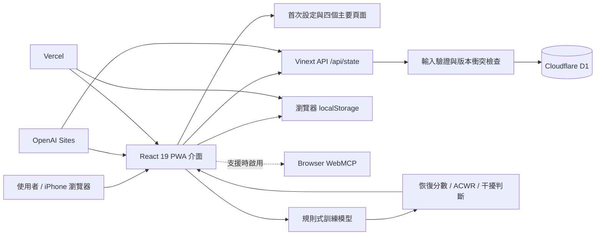

# TRIROX

TRIROX 是一套以 iOS 使用體驗為基準的混合型運動訓練 Web App，協助同時進行跑步、單車、游泳與功能性重訓的運動者安排課表、追蹤恢復狀態，並降低不同訓練互相干擾的風險。

## 問題與目標

混合型運動者通常需要在有限時間內同時安排耐力與肌力訓練。傳統課表往往只處理單一運動，無法一起考慮近期負荷、睡眠、HRV、主觀疲勞、肌肉痠痛、傷病限制與賽事日期，容易造成課表不切實際或訓練互相干擾。

TRIROX 的目標是讓初次使用者在數分鐘內輸入目標、可訓練時間與身體限制，建立保守的第一週課表；之後透過每日身體紀錄和訓練回報，逐步形成個人恢復基線。所有課表調整都必須由使用者確認，不會自動覆寫原始計畫。

## 核心功能

- 四步驟首次設定：賽事目標、可訓練日、運動項目、能力數據與傷病限制。
- 預設示範資料：首次開啟即可檢查 31 天身體紀錄、歷史訓練、本週課表與賽事資料。
- 今日頁：顯示身體紀錄入口、恢復狀態、今日課表與下一場賽事。
- 週課表：建立、檢視、編輯與確認每週混合訓練安排。
- 訓練回報：記錄實際時間、距離、強度、RPE、疲勞與痠痛部位。
- 恢復與負荷分析：以 HRV 個人基線、睡眠、主觀疲勞、ACWR 與訓練負荷提供保守判斷。
- 訓練干擾提示：傷病限制優先，建議調整需由使用者明確接受。
- 賽事與計時：支援 HYROX、馬拉松、鐵人三項目標，以及 HYROX 分段和鐵人轉換計時。
- 個人資料管理：管理能力基準、通知偏好、賽事、傷病限制與資料匯出。
- PWA：提供 Apple 主畫面圖示與 standalone 顯示模式。
- WebMCP 漸進增強：支援讀取訓練摘要與切換主要頁面；不支援的瀏覽器仍可正常操作。

## 系統架構



前端以 React 和 Vinext 建立行動優先介面。OpenAI Sites 版本透過 `/api/state` 讀寫單一運動者狀態，資料儲存在 Cloudflare D1；Vercel 版本則使用目前瀏覽器的 `localStorage`，不會跨瀏覽器或跨裝置同步。課表產生、恢復分數、ACWR 與干擾判斷目前在應用程式內以可測試的規則式函式完成。

## 使用技術

| 類型         | 技術／服務                                     | 用途                                                                   |
| ------------ | ---------------------------------------------- | ---------------------------------------------------------------------- |
| AI 模型      | 規則式訓練推薦引擎                             | 計算恢復狀態、標準化 ACWR、訓練干擾與保守調整；目前未呼叫外部生成式 AI |
| 前端         | React 19、TypeScript、Vinext、Base UI、Lucide  | PWA 介面、表單、圖示與互動流程                                         |
| 後端         | Vinext Server Functions、Cloudflare Workers    | Sites 版本提供 `/api/state`、資料驗證與儲存流程                        |
| 資料儲存     | Cloudflare D1、Drizzle ORM、localStorage       | Sites 使用 D1；Vercel 使用瀏覽器本機資料                               |
| 部署         | OpenAI Sites、Vercel                           | 提供私人展示版與公開 Web App 部署                                      |
| 品質工具     | Node.js Test Runner、TypeScript、Oxlint、Oxfmt | 單元測試、型別檢查、程式檢查與格式化                                   |

## 安裝與執行

需求：Node.js 22.13.0 以上版本。

```bash
# 1. 下載專案
git clone https://github.com/JimmyHungX/trirox.git
cd trirox

# 2. 安裝套件
npm install

# 3. 建立本機 D1 資料表
npx wrangler d1 execute DB \
  --local \
  --config wrangler.local.json \
  --file drizzle/0000_safe_blockbuster.sql

# 4. 啟動開發環境
npm run dev
```

瀏覽器開啟 `http://localhost:3000`。正式建置與檢查指令如下：

```bash
npm run typecheck
npm run lint
npm test
npm run build
npm run build:vercel
```

若修改 `db/schema.ts`，再執行 `npm run db:generate` 產生新的 migration；不要在沒有 schema 變更時覆寫既有 migration。

## Vercel 部署

把 GitHub 儲存庫匯入 Vercel 後可直接部署；根目錄的 `vercel.json` 會執行 `npm run build:vercel`，並輸出 Vercel Build Output API 格式。Vercel 版本會把使用者紀錄保存在目前瀏覽器，清除網站資料前應先從 App 設定匯出備份。

## 作品展示

- 作品展示網址：[TRIROX 線上版](https://trirox-hybrid-training.pompom119.chatgpt.site/)（目前為擁有者私人存取）
- 原始碼：[github.com/JimmyHungX/trirox](https://github.com/JimmyHungX/trirox)
- 評選影片：尚未提供

## 限制與未來工作

- 目前是行動優先 Web MVP，不是原生 iOS 或 App Store 應用程式。
- 第一版只儲存一位運動者的彙總狀態；公開分享前必須完成帳號系統與逐使用者資料隔離。
- Vercel 版本使用瀏覽器本機資料，不支援登入、跨裝置同步或伺服器備份。
- HealthKit、Garmin、COROS、背景推播與穿戴裝置 OAuth 尚未整合。
- HRV、ACWR、恢復分數和肌群負荷係數為暫定模型，需要運動科學校準與真實資料驗證。
- 能力自動校正、因果歸因與比賽成績預測尚未完成；資料不足時介面會保留未知值，不產生假預測。
- HYROX 與鐵人計時器目前只在前景工作，分段時間尚未持久化。
- WebMCP 採功能偵測，仍需在完整支援該介面的瀏覽器進行正式相容性驗證。
- 已完成 20 項核心演算法與輸入驗證測試；iPhone 實機和原生輔助使用測試仍待執行。

## 第三方服務、資料與素材

| 項目                    | 來源                                                            | 授權／使用方式                           |
| ----------------------- | --------------------------------------------------------------- | ---------------------------------------- |
| React / React DOM       | [react.dev](https://react.dev/)                                 | MIT License                              |
| Vinext                  | [cloudflare/vinext](https://github.com/cloudflare/vinext)       | MIT License                              |
| Drizzle ORM             | [orm.drizzle.team](https://orm.drizzle.team/)                   | Apache License 2.0                       |
| Base UI                 | [base-ui.com](https://base-ui.com/)                             | MIT License                              |
| Lucide Icons            | [lucide.dev](https://lucide.dev/)                               | ISC License                              |
| Cloudflare Workers / D1 | [developers.cloudflare.com](https://developers.cloudflare.com/) | 依 Cloudflare 服務條款使用               |
| OpenAI Sites            | OpenAI Sites 專案服務                                           | 依 OpenAI 服務條款使用；部署維持私人存取 |
| Vercel                  | [vercel.com](https://vercel.com/)                               | 依 Vercel 服務條款使用；公開部署        |
| 工程規格與 UI 參考圖    | `docs/`                                                         | 專案擁有者提供，僅供本專案實作使用       |

儲存庫不應提交 API 金鑰、Token、OAuth 憑證或真實個人健康資料；本機環境變數、Wrangler 狀態與建置輸出均已排除於版本控制之外。

## 團隊成員

| 姓名       | 分工                               |
| ---------- | ---------------------------------- |
| Jimmyhungx | 產品規劃、UI／UX、前後端開發與部署 |

## License

目前未指定開源授權。除上述第三方套件及素材各自適用的授權外，本專案內容保留所有權利。
