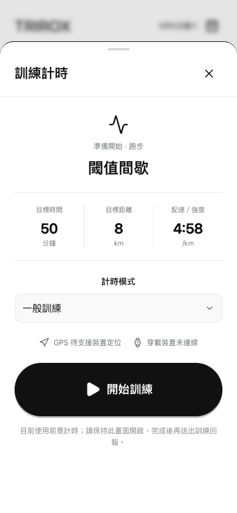
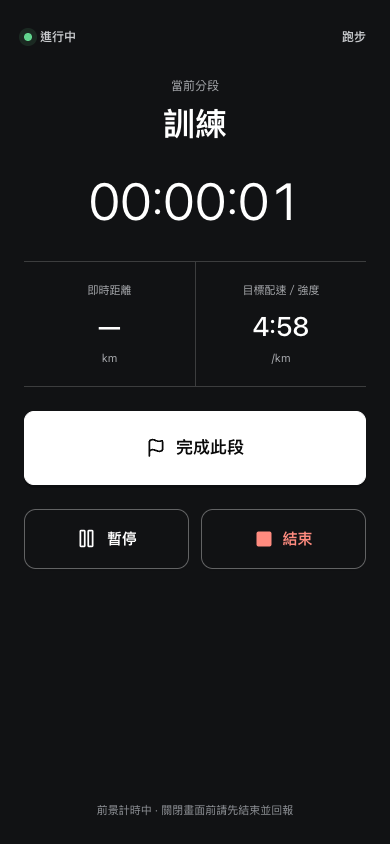
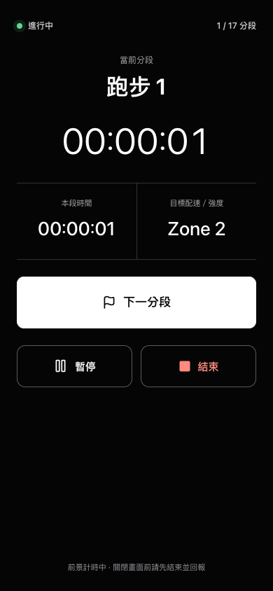

# TRIROX 互動與訓練計時規範

本規範只調整互動手感、開始訓練與進行中畫面，不改變資訊架構、訓練資料模型或 AI 建議確認流程。不得加入 streak、XP、徽章、成就或慶祝動畫。

## 1. 手機畫面基準

- 設計寬度：375-390 px，直向。
- 觸控目標：一般控制至少 44 x 44 px；主要訓練控制至少 60 px 高。
- 開始訓練按鈕：88 px 高、膠囊外形，是開始前畫面最大的互動元件。
- HYROX 下一分段按鈕：至少 74 px 高，使用高對比深綠與白字配色。
- 安全區：底部操作區加入 `env(safe-area-inset-bottom)`。

## 2. 開始訓練畫面

```text
+--------------------------------------+
|               跑步 icon              |
|          準備開始 / 跑步              |
|              閾值間歇                 |
|                                      |
|  目標時間       目標距離      配速     |
|    50            8.0         4:58     |
|   分鐘            km          /km     |
|                                      |
|  計時模式                            |
|  [一般訓練                       v]   |
|                                      |
|  GPS 待定位     穿戴裝置未連線         |
|                                      |
|  [          開始訓練              ]   |
|       前景計時，請保持畫面開啟          |
+--------------------------------------+
```

- 目標時間、距離及配速／強度採三欄大數字，沒有能力基準時顯示 RPE，不建立假配速。
- 尚未接入定位或穿戴裝置時明確顯示「待定位／未連線」，不得偽造連線成功。
- HYROX 課表預設選取 17 分段模式；其他課表維持一般訓練，使用者仍可切換既有計時模式。

高保真實作稿：



## 3. 訓練進行中畫面

```text
+--------------------------------------+
|  * 進行中                 6 / 17 分段 |
|                                      |
|               當前分段                |
|               划船機                  |
|                                      |
|             00:24:18                 |
|                                      |
|       本段時間          目標強度       |
|       00:03:42           Zone 3       |
|                                      |
|  [           下一分段             ]   |
|                                      |
|  [      暫停      ] [      結束     ] |
|                                      |
|       前景計時中 / 結束後回報          |
+--------------------------------------+
```

- 進行中畫面使用淡綠灰背景、深色文字與深綠主操作，中央只保留當前分段、總時間和兩項必要數據；維持戶外可讀性但不切換成深色模式。
- 沒有 GPS 或感測器資料時顯示破折號，不用推估值冒充即時量測。
- HYROX 顯示目前分段序號與最近三筆分段結果；切換分段使用較明顯的雙脈衝震動。
- 暫停與結束固定在底部控制區；結束仍導向既有訓練回報，不直接建立完成紀錄。

高保真實作稿：





## 4. 動畫數值

| 項目         | 數值               | 曲線／位移                                                           |
| ------------ | ------------------ | -------------------------------------------------------------------- |
| 按下回饋     | 100-110 ms、0 延遲 | `scale: 0.96`、`opacity: 0.85`、亮度 94%                             |
| 放開回彈     | 100-120 ms         | `cubic-bezier(0.34, 1.56, 0.64, 1)`                                  |
| 主頁切換     | 260 ms             | 淡入並由下方移動 5 px，使用 spring cubic-bezier                      |
| Bottom sheet | 物理彈簧           | Framer Motion `damping: 30`、`stiffness: 300`；遮罩 150 ms 淡入淡出  |
| 成功提示     | 180 ms 進場        | 由下方移動 8 px並淡入                                                |
| 成功勾選     | 420 ms             | 描邊出現，不使用放大慶祝效果                                         |
| 恢復分數更新 | 物理彈簧           | Framer Motion `damping: 20`、`stiffness: 100`、`mass: 0.6`，整數滾動 |

若系統開啟 `prefers-reduced-motion: reduce`，停用位移、縮放與動畫，功能與狀態文字保持完整。

## 5. 震動規格

| 層級   | Web pattern            | 觸發時機                                              |
| ------ | ---------------------- | ----------------------------------------------------- |
| Light  | 10 ms                  | 主要表單送出、課表拖曳完成、開始／暫停／繼續、資料匯出、Switch 切換 |
| Medium | 18 ms、停 24 ms、18 ms | 套用 AI 建議、刪除二次確認、結束訓練、HYROX 下一分段  |
| None   | 無                     | 導航、查看資料、返回、取消、開啟一般面板              |

Web 版本透過 `navigator.vibrate` 漸進增強。瀏覽器或 iOS 版本不支援時不顯示錯誤，改由相同的視覺按壓回饋承擔確認感；不得以音效替代。

表單送出與按鈕標記使用同一個共用震動入口；已指定 `data-haptic` 的送出按鈕不會再觸發一次表單預設震動。

## 6. 樂觀更新

- 儲存動作先更新前端狀態，再於背景寫入瀏覽器或 `/api/state`。
- 寫入失敗時回復操作前狀態並保留錯誤提示。
- 發生 revision 衝突時回復後重新讀取伺服器最新版本，避免舊資料覆蓋新資料。
- 需要保留表單輸入或等待伺服器驗證結果的面板，只先更新背後資料，確認成功後才關閉面板。
- 首次資料讀取、外部裝置 OAuth 與不可逆動作不做樂觀成功假象；刪除仍需二次確認。

## 7. 週課表手勢

- 計畫頁頂部固定顯示今日訓練快捷入口；未完成課表可直接進入開始前確認，傷病限制狀態則先進入課表詳情，不得繞過限制。
- 週課表中的當日整列使用淡綠底、左側綠線與「今天」文字標示，不能只依賴顏色辨識。
- 未完成課表可使用右側把手拖曳至同一週的其他日期，放開後立即樂觀更新並儲存。
- 課表本體向右滑動 88 px，或滑動速度達 650 px/s 時，開啟刪除二次確認；手勢本身不直接刪除。
- 已有訓練回報的課表不顯示拖曳把手，也不接受滑動刪除，避免破壞歷史紀錄。
- 拖曳中的日期使用淡綠底與左側綠線表示可放置範圍；手機垂直捲動由拖曳把手以外的區域維持。

## 8. 驗收重點

- 主要動作按下後立刻有視覺回饋，動畫不阻擋事件或延遲頁面切換。
- 計時開始後不能再切換模式。
- HYROX 維持完整 17 分段，分段按鈕可單手操作。
- AI 建議仍需使用者明確確認後才修改課表。
- 傷病限制仍可停用開始訓練按鈕。
- 分析與設定頁只套用通用按壓、轉場和震動，不新增裝飾內容。
