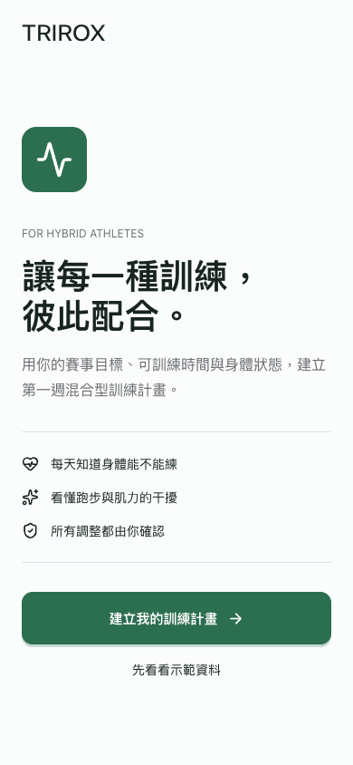
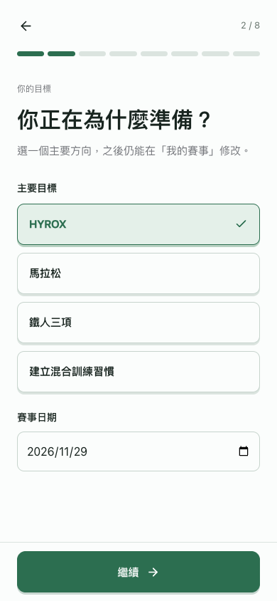
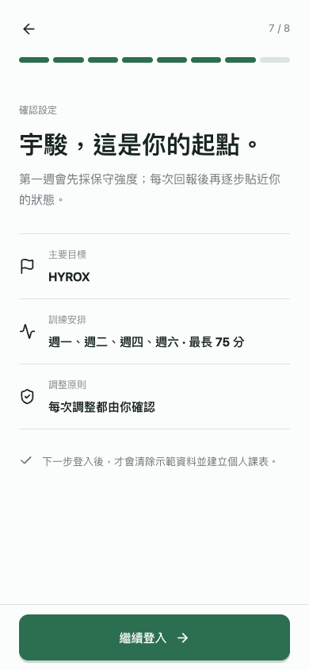
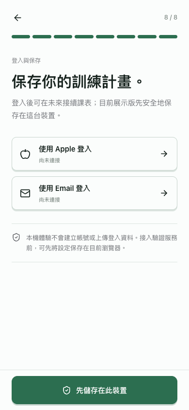

# TRIROX 首次使用與登入 UX 規格

本流程借鑑 Duolingo 的單題單頁、明確進度、即時選取回饋與固定主要按鈕，但不使用 streak、XP、徽章、成就或慶祝動畫。

## 流程順序

| 步驟 | 畫面 | 完成條件 |
| --- | --- | --- |
| 0 | 歡迎 | 選擇建立個人計畫或查看示範資料 |
| 1 | 稱呼 | 名稱不可為空白 |
| 2 | 主要目標 | 選擇目標；有賽事時日期不可早於今天 |
| 3 | 可訓練時間 | 至少選擇一天，並設定單次最長時間 |
| 4 | 運動組合 | 至少選擇一項運動 |
| 5 | 能力設定 | 選擇程度；配速與 FTP 可選填 |
| 6 | 傷病限制 | 啟用限制時必須填寫說明 |
| 7 | 設定確認 | 檢查目標、安排與限制原則 |
| 8 | 登入與保存 | 進入帳號銜接畫面後才建立個人課表 |

## 互動規格

- 進度列：八等分、7 px 高；已完成與當前步驟使用深綠，未完成使用淡灰綠。
- 返回按鈕：44 x 44 px，只回到上一題，不清除已填內容。
- 主要按鈕：至少 58 px 高，固定在安全區上方；無效時停用並保留原因所需欄位。
- 選項按鈕：至少 54-58 px 高；選中後使用淡綠背景、深綠邊框、勾選圖示及 3 px 底部陰影。
- 按壓回饋：120 ms、`scale: 0.96-0.97`，放開立即回彈；不延遲頁面切換。
- 錯誤處理：使用者留在原步驟，錯誤靠近相關內容顯示，不清除已填資料。
- 長內容：頁面可垂直捲動，底部預留固定按鈕高度，最後一個欄位能完整移到按鈕上方。

## 登入原則

- 個人化資訊必須先填完並確認，之後才顯示登入選項。
- 未接入的 Apple／Email 登入不得假裝成功；點擊後明確說明需要正式帳號服務。
- 展示版提供「先儲存在此裝置」，完成後建立個人課表並清除示範狀態。
- 接入正式驗證服務後，應以成功取得的帳號識別碼保存設定，不得把密碼直接寫入應用資料模型或 localStorage。

## 高保真畫面

